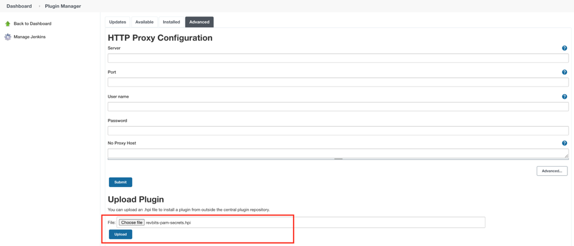
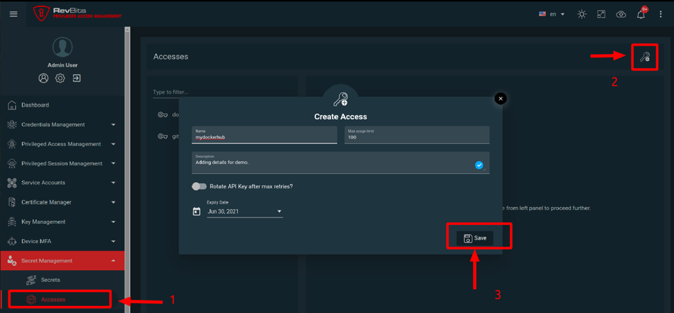
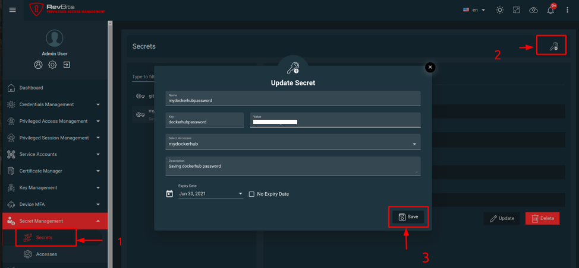
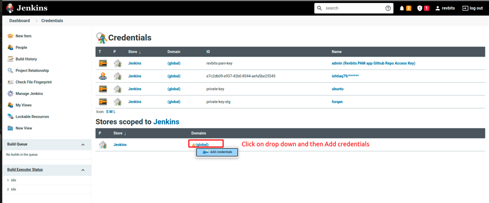
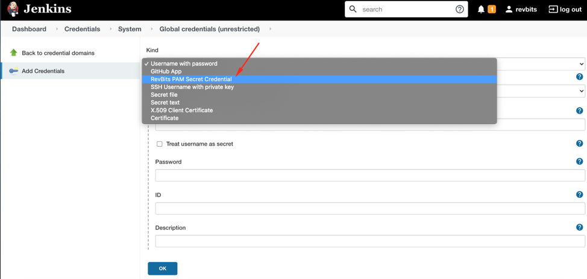
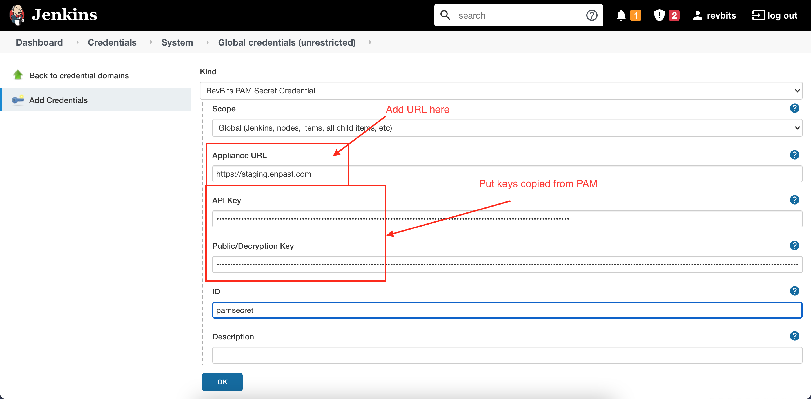
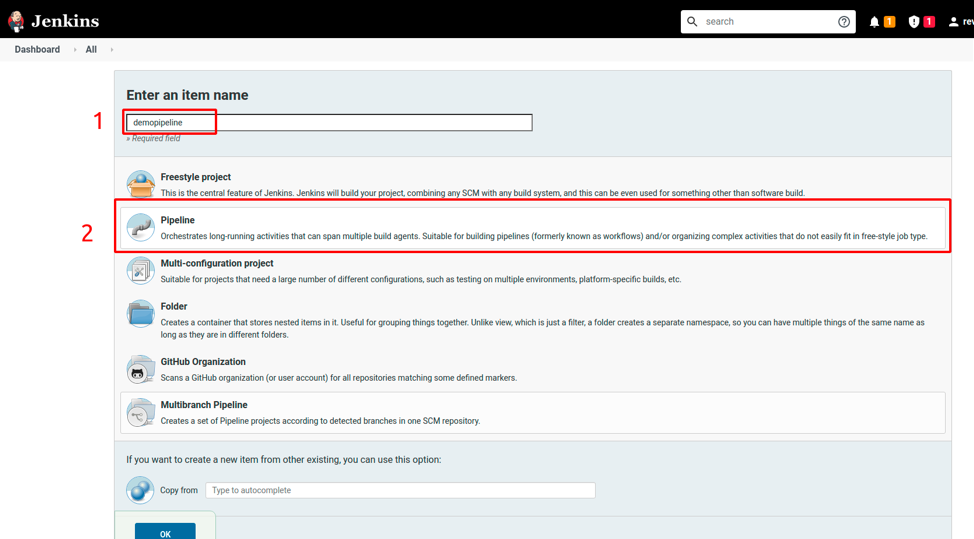
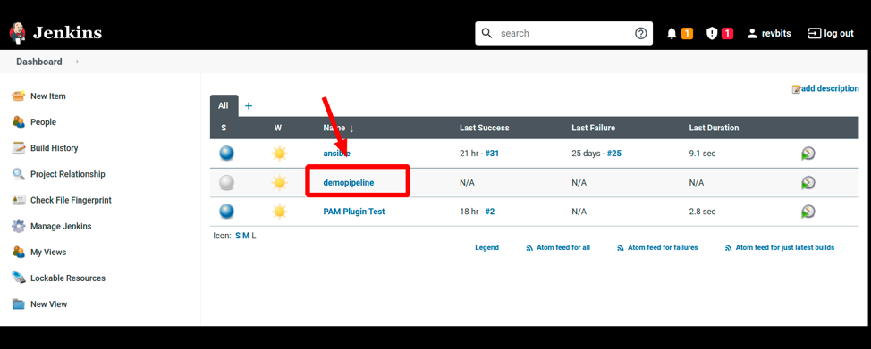
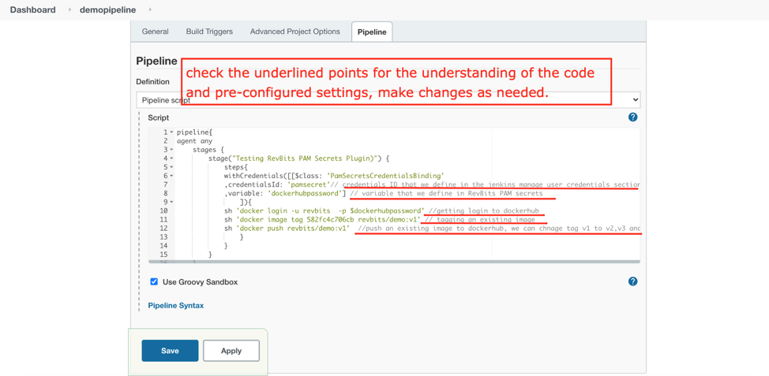
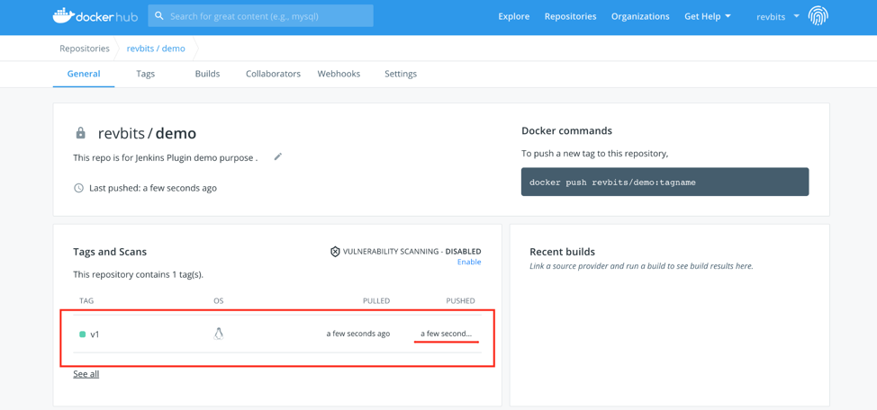

# RevBits PAM Secret Plugin

## Introduction

RevBits PAM secrets manager plugin securely fetches secrets from RevBits PAM.

## Getting started

### Plugin Build-up

To compile plugin .hpi file:

```
mvn clean install
```

To run standalone plugin with jenkins server:

```
mvn hpi:run
```

## Installing the RevBits PAM Secret Plugin
### Manual Install
Login to Jenkins and navigate to Dashboard > Manage Jenkins > Manage Plugins > Advance > Upload Plugin (Upload plugin with .hpi extension)


#### Uploading RevBits PAM Secret Plugin:

Navigate to: Advance > Upload Plugin


## Add Credentials in RevBits PAM server

Adding Docker Hub credentials in the RevBits PAM server.

Navigate to: Secret Management > Accesses > Add Access



Navigate to: Secrets > Add Secret



## Connecting the Plugin to Revbits PAM.

Navigate to: Dashboard > Manage Jenkins > Manage Credentials


Adding credentials



Select Revbits PAM Secret Credentials from drop down menu



Filling the credential form as per requirement and copying the API key from the RevBits PAM.


Using secrets in Jenkins project to define the variable explicitly



## Creating a new pipeline project and writing a pipeline code to fetch secrets.

To create new pipeline project, Navigate to > Dashboard > New Item



Navigate to: Dashboard and Select newly created pipeline “demopipeline”



Navigate to Dashboard > Select “demopipeline” > Configure


Navigate to Advance Project Options and add the following code as provided

```groovy
pipeline{
agent any
    stages {
        stage("Testing RevBits PAM Secrets Plugin)") {
            steps{
            withCredentials([[$class: 'PamSecretsCredentialsBinding'
            ,credentialsId: 'jenkinsid'// credentials ID that we define in the jenkins manage user credentials section
            ,variable: 'dockerhub'] // variable that we define in RevBits PAM secrets
                ]){

           sh "docker login -u username  -p ${env.dockerhub}"   // getting login to dockerhub
           sh "docker push username/jenkins-demo-nginx:v1"  // push an existing image to dockerhub, we can chnage tag v1 to v2,v3 and so on
                }
            }
        }
    }
}
```



## Run job and verify results

Navigate to: Dashboard > Select “demo pipeline” > Trigger “Build Now”


After successfully running a job, login to Dockerhub. It can be seen the image is pushed to Dockerhub.



## License

This repository is licensed under Apache License 2.0 - see [`LICENSE`](LICENSE.md) for more details.